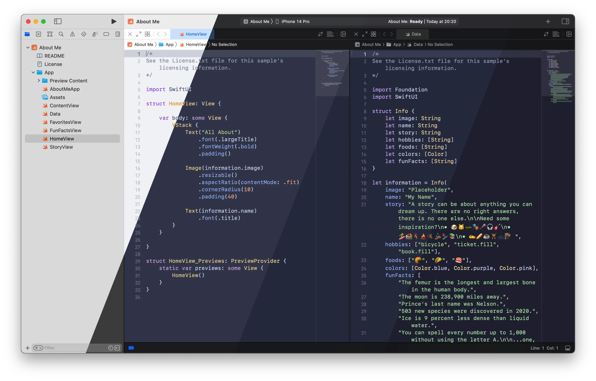
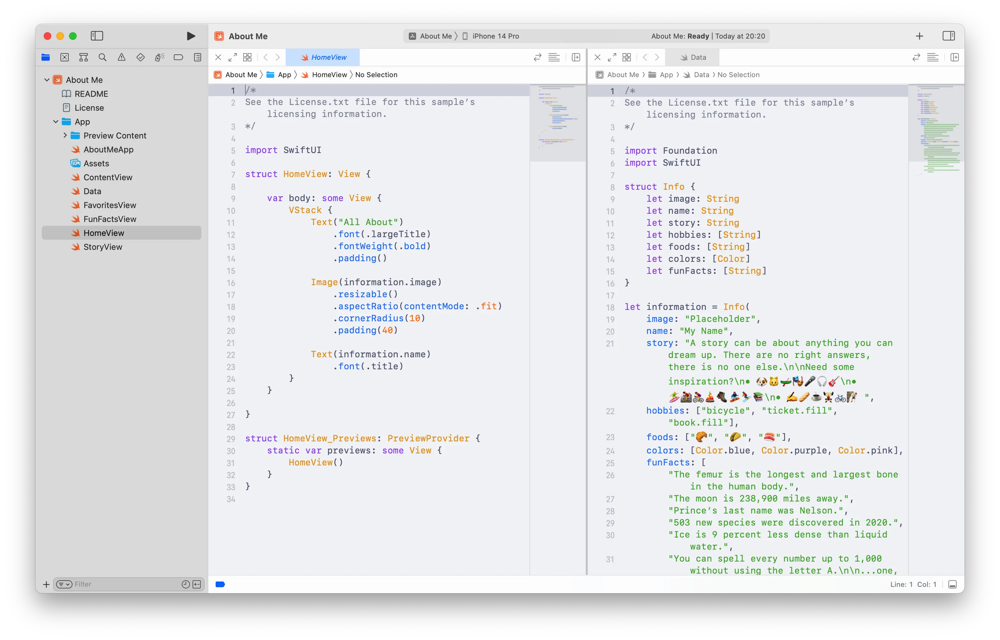
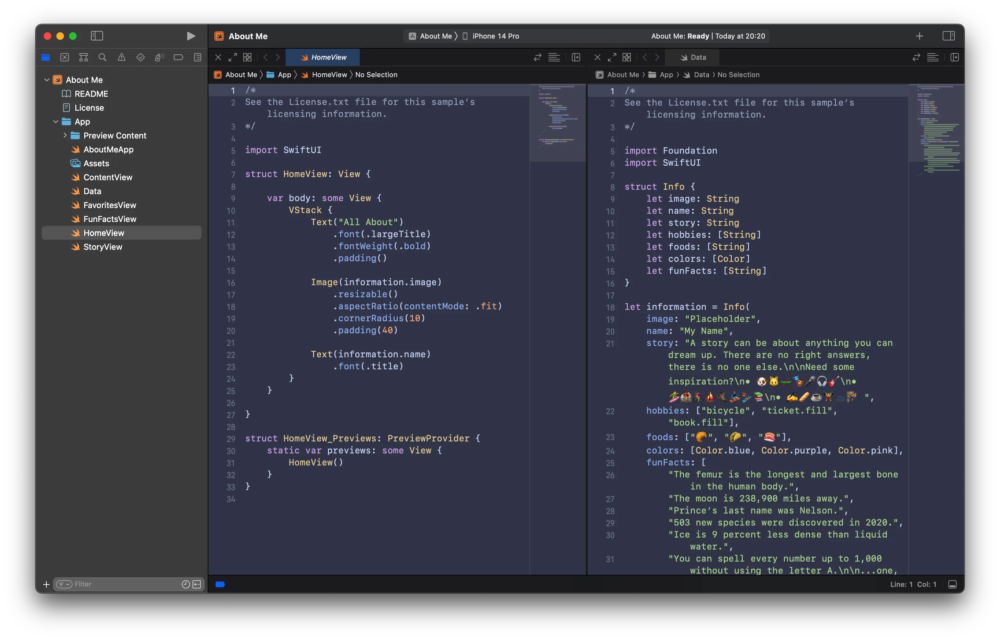
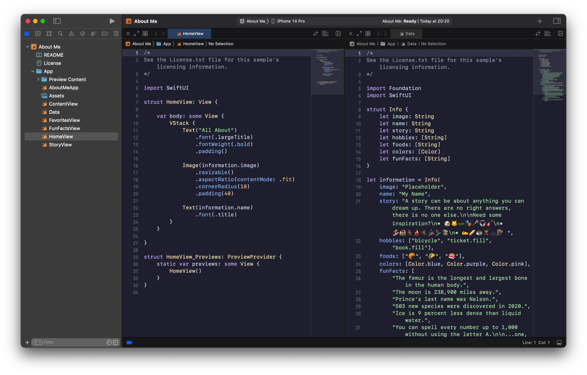

<h3 align="center">
	<br/>
	
	Catppuccin for <a href="https://developer.apple.com/xcode">Xcode</a>
	
</h3>

<p align="center">
	<a href="https://github.com/catppuccin/xcode/stargazers"></a>
	<a href="https://github.com/catppuccin/xcode/issues"></a>
	<a href="https://github.com/catppuccin/xcode/contributors"></a>
</p>

<p align="center">
	
</p>

## Previews

<details>
<summary>🌻 Latte</summary>

</details>
<details>
<summary>🪴 Frappé</summary>

</details>
<details>
<summary>🌺 Macchiato</summary>

</details>
<details>
<summary>🌿 Mocha</summary>

</details>

## Usage

1. Make the script executable:
   ```bash
   chmod +x manage-themes.sh
   ```
2. Run the script:
   ```bash
   ./manage-themes.sh
   ```
3. Choose one of the options from the script:
   - **Install themes**: This will copy the themes to the appropriate directory.
   - **Uninstall themes**: This will remove all Catppuccin themes from the Xcode theme directory.

4. Go to **Xcode** > **Preferences** (<kbd>Command</kbd> + <kbd>,</kbd>), choose the **Themes** tab, and select your desired Catppuccin theme.

## 💝 Thanks to

- [Quentin](https://github.com/quentinguidee)

&nbsp;

<p align="center">
	
</p>

<p align="center">
	Copyright &copy; 2021-present <a href="https://github.com/catppuccin" target="_blank">Catppuccin Org</a>
</p>

<p align="center">
	<a href="https://github.com/catppuccin/catppuccin/blob/main/LICENSE"></a>
</p>
